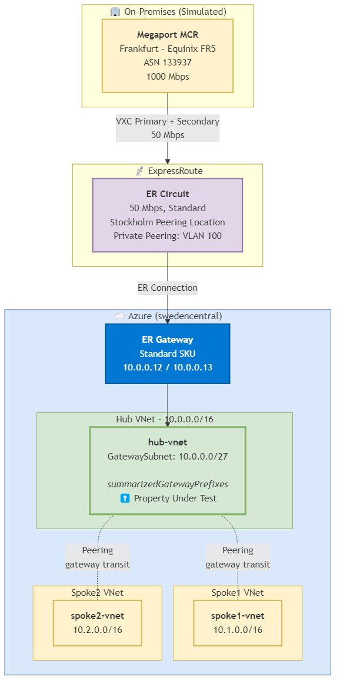
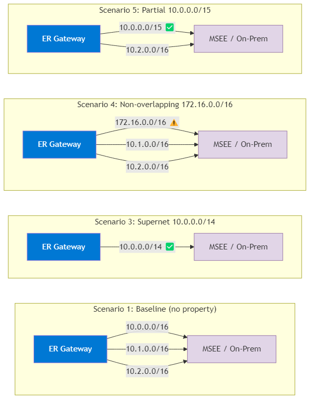

# Azure Lab: `summarizedGatewayPrefixes` VNet Property

## Executive Summary

The `summarizedGatewayPrefixes` property is a **new VNet-level setting** (API version `2025-07-01`) that controls which prefixes an ExpressRoute gateway advertises to on-premises networks. By default, an ER gateway advertises every VNet prefix individually (hub + all peered spokes). This property lets you **replace the hub VNet's own prefix** with a custom summary or arbitrary prefix in the ER gateway's BGP advertisements.

### Key Findings

| # | Scenario | Result |
|---|----------|--------|
| 1 | **Baseline** (no property set) | All 3 VNet prefixes advertised individually: `10.0.0.0/16`, `10.1.0.0/16`, `10.2.0.0/16` |
| 2 | **Read default value** | Property is `null` by default |
| 3 | **Supernet covering all VNets** (`10.0.0.0/14`) | ✅ All 3 individual /16 prefixes **replaced** by a single `10.0.0.0/14` |
| 4 | **Non-overlapping prefix** (`172.16.0.0/16`) | ⚠️ Azure **accepts** it — hub's `10.0.0.0/16` replaced by `172.16.0.0/16`, spoke prefixes unchanged |
| 5 | **Partial supernet** (`10.0.0.0/15`) | Hub + spoke1 replaced by `10.0.0.0/15`; spoke2 (`10.2.0.0/16`) still advertised individually |
| 6 | **Clear property** (set to null) | ✅ Routes revert to original 3 individual /16 prefixes |

### Conclusions

1. **`summarizedGatewayPrefixes` replaces the hub VNet's prefix** in ER gateway advertisements. It does NOT add to it — it substitutes.
2. **Spoke VNet prefixes covered by the summarized range are also replaced.** Spokes outside the range remain advertised individually.
3. **Azure does NOT validate overlap.** You can inject a completely unrelated prefix (e.g., `172.16.0.0/16`) and it will be advertised to on-premises — this could be useful for route manipulation but also dangerous if misconfigured.
4. **The property is instantly reversible** — setting it back to `null` restores the original individual prefix advertisements.
5. **The property is set on the hub VNet**, not on the ER gateway or circuit. It only affects what the ER gateway in that VNet advertises.

---

## Lab Topology



> 📂 Editable draw.io files available in the [diagrams/](diagrams/) folder.

## Lab Setup (Azure CLI)

All resources were deployed in resource group `lab-summarized-gw-prefixes-20260427` in the `swedencentral` region.

### 1. Resource Group

```bash
az group create -n lab-summarized-gw-prefixes-20260427 -l swedencentral \
  --tags lab=true created_by=copilot-lab feature=summarized-gw-prefixes
```

### 2. Virtual Networks

```bash
# Hub VNet
az network vnet create -g lab-summarized-gw-prefixes-20260427 -n hub-vnet \
  --address-prefix 10.0.0.0/16 -l swedencentral

# GatewaySubnet (required for ER gateway)
az network vnet subnet create -g lab-summarized-gw-prefixes-20260427 \
  --vnet-name hub-vnet -n GatewaySubnet --address-prefix 10.0.0.0/27

# Spoke 1
az network vnet create -g lab-summarized-gw-prefixes-20260427 -n spoke1-vnet \
  --address-prefix 10.1.0.0/16 -l swedencentral

# Spoke 2
az network vnet create -g lab-summarized-gw-prefixes-20260427 -n spoke2-vnet \
  --address-prefix 10.2.0.0/16 -l swedencentral
```

### 3. VNet Peerings (with Gateway Transit)

```bash
# Hub → Spoke1
az network vnet peering create -g lab-summarized-gw-prefixes-20260427 \
  -n hub-to-spoke1 --vnet-name hub-vnet --remote-vnet spoke1-vnet \
  --allow-vnet-access --allow-gateway-transit --allow-forwarded-traffic

# Spoke1 → Hub
az network vnet peering create -g lab-summarized-gw-prefixes-20260427 \
  -n spoke1-to-hub --vnet-name spoke1-vnet --remote-vnet hub-vnet \
  --allow-vnet-access --allow-forwarded-traffic --use-remote-gateways

# Hub → Spoke2
az network vnet peering create -g lab-summarized-gw-prefixes-20260427 \
  -n hub-to-spoke2 --vnet-name hub-vnet --remote-vnet spoke2-vnet \
  --allow-vnet-access --allow-gateway-transit --allow-forwarded-traffic

# Spoke2 → Hub
az network vnet peering create -g lab-summarized-gw-prefixes-20260427 \
  -n spoke2-to-hub --vnet-name spoke2-vnet --remote-vnet hub-vnet \
  --allow-vnet-access --allow-forwarded-traffic --use-remote-gateways
```

### 4. ExpressRoute Circuit

```bash
az network express-route create -g lab-summarized-gw-prefixes-20260427 \
  -n lab-er-circuit --bandwidth 50 --peering-location Stockholm \
  --provider Megaport --sku-family MeteredData --sku-tier Standard
```

### 5. ExpressRoute Gateway

```bash
# Public IP for the gateway
az network public-ip create -g lab-summarized-gw-prefixes-20260427 \
  -n hub-ergw-pip --sku Standard --allocation-method Static

# ER Gateway (Standard SKU — ~30-40 min deployment)
az network vnet-gateway create -g lab-summarized-gw-prefixes-20260427 \
  -n hub-ergw --vnet hub-vnet --gateway-type ExpressRoute \
  --sku Standard --public-ip-address hub-ergw-pip
```

### 6. Megaport MCR + VXC (ExpressRoute Provider)

A Megaport Cloud Router (MCR) was created in Frankfurt (Equinix FR5) via the Megaport REST API, with two VXCs (primary + secondary) connected to the ExpressRoute circuit's service key. The MCR auto-configured BGP peering with ASN 133937.

> **Note:** The MCR was deployed in Frankfurt because the Megaport account did not have the Sweden market enabled. Cross-region VXC between Frankfurt MCR and Stockholm ER ports works transparently.

### 7. ExpressRoute Connection

```bash
az network vpn-connection create -g lab-summarized-gw-prefixes-20260427 \
  -n lab-er-connection --vnet-gateway1 hub-ergw \
  --express-route-circuit2 lab-er-circuit
```

### 8. Setting `summarizedGatewayPrefixes` (az rest)

The property is not yet supported by Azure CLI (see [azure-cli#32860](https://github.com/Azure/azure-cli/issues/32860)). It must be set via the REST API:

```bash
# 1. GET current VNet definition
az rest --method GET \
  --url "https://management.azure.com/subscriptions/{sub}/resourceGroups/{rg}/providers/Microsoft.Network/virtualNetworks/hub-vnet?api-version=2025-07-01" \
  > vnet_body.json

# 2. Edit vnet_body.json to add/modify summarizedGatewayPrefixes
# Set:   "summarizedGatewayPrefixes": {"addressPrefixes": ["10.0.0.0/14"]}
# Clear: "summarizedGatewayPrefixes": null

# 3. PUT updated VNet definition
az rest --method PUT \
  --url "https://management.azure.com/subscriptions/{sub}/resourceGroups/{rg}/providers/Microsoft.Network/virtualNetworks/hub-vnet?api-version=2025-07-01" \
  --body @vnet_body.json --headers "Content-Type=application/json"
```

---

## Test Scenarios & Results

### Route Advertisement Comparison



---

### Scenario 1: Baseline — No `summarizedGatewayPrefixes`

**Objective:** Capture the default route advertisements from the ER gateway with a hub-spoke topology.

**ER Gateway Advertised Routes:**

```
Network      NextHop    Origin    AsPath    Weight
-----------  ---------  --------  --------  --------
10.0.0.0/16  10.0.0.12  Igp       65515     0
10.1.0.0/16  10.0.0.12  Igp       65515     0
10.2.0.0/16  10.0.0.12  Igp       65515     0
```

**ER Circuit Route Table (AzurePrivatePeering, primary path):**

| Network | NextHop | Path | LocPrf |
|---------|---------|------|--------|
| 10.0.0.0/16 | 10.0.0.12* | 65515 I | 100 |
| 10.0.0.0/16 | 10.0.0.13 | 65515 I | 100 |
| 10.1.0.0/16 | 10.0.0.12* | 65515 I | 100 |
| 10.1.0.0/16 | 10.0.0.13 | 65515 I | 100 |
| 10.2.0.0/16 | 10.0.0.12* | 65515 I | 100 |
| 10.2.0.0/16 | 10.0.0.13 | 65515 I | 100 |

**Result:** All 3 VNet address spaces advertised individually from both gateway instances (10.0.0.12 and 10.0.0.13). This is the expected default behavior.

---

### Scenario 2: Read Default Property Value

**Objective:** Check the default value of `summarizedGatewayPrefixes` on a VNet.

```bash
az rest --method GET \
  --url ".../virtualNetworks/hub-vnet?api-version=2025-07-01" \
  --query "properties.summarizedGatewayPrefixes"
```

**Result:** `null` — the property does not exist by default.

---

### Scenario 3: Supernet `10.0.0.0/14` (Covers All VNets)

**Objective:** Set a supernet that covers all three VNets (hub `10.0.0.0/16`, spoke1 `10.1.0.0/16`, spoke2 `10.2.0.0/16` all fall within `10.0.0.0/14`).

**Configuration applied:**
```json
"summarizedGatewayPrefixes": {
  "addressPrefixes": ["10.0.0.0/14"]
}
```

**ER Gateway Advertised Routes:**

```
Network      NextHop    Origin    AsPath    Weight
-----------  ---------  --------  --------  --------
10.0.0.0/14  10.0.0.12  Igp       65515     0
```

**ER Circuit Route Table:**

| Network | NextHop | Path | LocPrf |
|---------|---------|------|--------|
| 10.0.0.0/14 | 10.0.0.12* | 65515 I | 100 |
| 10.0.0.0/14 | 10.0.0.13 | 65515 I | 100 |

**Result:** ⭐ **All 3 individual /16 prefixes replaced by a single `10.0.0.0/14` supernet.** The summarization works as expected — fewer, more aggregated routes are advertised to on-premises.

---

### Scenario 4: Non-Overlapping Prefix `172.16.0.0/16`

**Objective:** Test whether Azure validates that the summarized prefix overlaps with actual VNet address spaces.

**Configuration applied:**
```json
"summarizedGatewayPrefixes": {
  "addressPrefixes": ["172.16.0.0/16"]
}
```

**ER Gateway Advertised Routes:**

```
Network        NextHop    Origin    AsPath    Weight
-------------  ---------  --------  --------  --------
172.16.0.0/16  10.0.0.12  Igp       65515     0
10.1.0.0/16    10.0.0.12  Igp       65515     0
10.2.0.0/16    10.0.0.12  Igp       65515     0
```

**ER Circuit Route Table:**

| Network | NextHop | Path | LocPrf |
|---------|---------|------|--------|
| 172.16.0.0/16 | 10.0.0.12* | 65515 I | 100 |
| 172.16.0.0/16 | 10.0.0.13 | 65515 I | 100 |
| 10.1.0.0/16 | 10.0.0.12* | 65515 I | 100 |
| 10.1.0.0/16 | 10.0.0.13 | 65515 I | 100 |
| 10.2.0.0/16 | 10.0.0.12* | 65515 I | 100 |
| 10.2.0.0/16 | 10.0.0.13 | 65515 I | 100 |

**Result:** ⚠️ **Azure accepts a completely non-overlapping prefix.** The hub's own `10.0.0.0/16` is **replaced** by `172.16.0.0/16`. Spoke prefixes remain unchanged because they are not covered by the summarized prefix. This means:
- There is **no validation** that the summarized prefix must overlap with actual address spaces
- The hub VNet prefix (`10.0.0.0/16`) is **no longer advertised** — on-premises would not know how to reach it via the ER gateway
- This could be used for route manipulation (e.g., advertising a different aggregate to on-premises) but could also cause reachability issues if misconfigured

---

### Scenario 5: Partial Supernet `10.0.0.0/15`

**Objective:** Test a prefix that covers the hub (`10.0.0.0/16`) and spoke1 (`10.1.0.0/16`) but NOT spoke2 (`10.2.0.0/16`).

**Configuration applied:**
```json
"summarizedGatewayPrefixes": {
  "addressPrefixes": ["10.0.0.0/15"]
}
```

**ER Gateway Advertised Routes:**

```
Network      NextHop    Origin    AsPath    Weight
-----------  ---------  --------  --------  --------
10.0.0.0/15  10.0.0.12  Igp       65515     0
10.2.0.0/16  10.0.0.12  Igp       65515     0
```

**ER Circuit Route Table:**

| Network | NextHop | Path | LocPrf |
|---------|---------|------|--------|
| 10.0.0.0/15 | 10.0.0.12* | 65515 I | 100 |
| 10.0.0.0/15 | 10.0.0.13 | 65515 I | 100 |
| 10.2.0.0/16 | 10.0.0.12* | 65515 I | 100 |
| 10.2.0.0/16 | 10.0.0.13 | 65515 I | 100 |

**Result:** ⭐ **Both covered prefixes (hub + spoke1) are replaced by `10.0.0.0/15`.** The uncovered spoke2 (`10.2.0.0/16`) continues to be advertised individually. This confirms that the summarization operates on a "covers/replaces" basis — any VNet prefix (hub or spoke) that falls within the summarized range is absorbed into it.

---

### Scenario 6: Clear Property (Revert)

**Objective:** Remove `summarizedGatewayPrefixes` and verify routes revert to original behavior.

**Configuration applied:**
```json
"summarizedGatewayPrefixes": null
```

**ER Gateway Advertised Routes:**

```
Network      NextHop    Origin    AsPath    Weight
-----------  ---------  --------  --------  --------
10.2.0.0/16  10.0.0.12  Igp       65515     0
10.0.0.0/16  10.0.0.12  Igp       65515     0
10.1.0.0/16  10.0.0.12  Igp       65515     0
```

**ER Circuit Route Table:**

| Network | NextHop | Path | LocPrf |
|---------|---------|------|--------|
| 10.0.0.0/16 | 10.0.0.12* | 65515 I | 100 |
| 10.0.0.0/16 | 10.0.0.13 | 65515 I | 100 |
| 10.1.0.0/16 | 10.0.0.12* | 65515 I | 100 |
| 10.1.0.0/16 | 10.0.0.13 | 65515 I | 100 |
| 10.2.0.0/16 | 10.0.0.12* | 65515 I | 100 |
| 10.2.0.0/16 | 10.0.0.13 | 65515 I | 100 |

**Result:** ✅ **Routes fully reverted** to the original 3 individual /16 prefixes. The property change is immediately reversible.

---

## Summary of Behavior

```
┌─────────────────────────────────────────────────────────┐
│         summarizedGatewayPrefixes Behavior               │
├─────────────────────────────────────────────────────────┤
│                                                         │
│  Property set on: Hub VNet (not gateway, not circuit)   │
│                                                         │
│  What it does:                                          │
│  • REPLACES the hub VNet's own prefix in ER gateway     │
│    BGP advertisements                                   │
│  • Also REPLACES spoke VNet prefixes that fall within   │
│    the summarized range                                 │
│  • Spoke prefixes outside the range are unaffected      │
│                                                         │
│  What it does NOT do:                                   │
│  • Does NOT validate overlap with actual VNet ranges    │
│  • Does NOT add to existing advertisements (replaces)   │
│  • Does NOT affect the data plane (routing within Azure │
│    still works via individual VNet prefixes)             │
│                                                         │
│  Reversal: Set to null → instantly reverts              │
│                                                         │
│  CLI support: Not yet (use az rest with API 2025-07-01) │
│  Tracking: https://github.com/Azure/azure-cli/issues/32860 │
└─────────────────────────────────────────────────────────┘
```

## Lab Metadata

| Field | Value |
|-------|-------|
| **Date** | 2025-04-27 |
| **Region** | swedencentral |
| **Resource Group** | `lab-summarized-gw-prefixes-20260427` |
| **ER Circuit** | 50 Mbps, Standard, MeteredData, Stockholm |
| **ER Gateway** | Standard SKU |
| **Megaport MCR** | Frankfurt (Equinix FR5), ASN 133937 |
| **API Version** | `2025-07-01` |
| **Created by** | GitHub Copilot CLI (azure-lab skill) |

## Raw Output

All raw command output (JSON) from Azure CLI and Megaport API is stored in the [`raw-output/`](raw-output/) folder:

| File | Description |
|------|-------------|
| `scenario6-ergw-advertised.json` | ER Gateway advertised routes (baseline, after clearing property) |
| `scenario6-er-circuit-routes.json` | ER Circuit route table (baseline) |
| `scenario6-ergw-learned.json` | ER Gateway learned routes |
| `hub-vnet-definition.json` | Full hub VNet definition (API version 2025-07-01) |
| `megaport-mcr-details.json` | MCR product details from Megaport API |
| `megaport-vxc-primary-details.json` | Primary VXC details including BGP session config |
| `megaport-vxc-secondary-details.json` | Secondary VXC details including BGP session config |
| `megaport-mcr-bgp-routes.json` | MCR BGP route table (empty — see note below) |

### Note on Megaport MCR Route Collection

The Megaport API endpoint `GET /v2/product/mcr2/{uid}/diagnostics/routes/bgp` returns `200 OK` but with an empty array `[]` for this MCR. BGP sessions are confirmed as **established** (`bgp_status: 1`) on both primary and secondary VXCs. The empty route table response appears to be an API limitation — possibly related to the cross-region MCR↔VXC setup (MCR in Frankfurt, ER circuit in Stockholm) or the demo account type. The VXC resource details do confirm the BGP peering configuration:

- **Primary VXC:** MCR peer `169.254.247.209/30` ↔ MSEE `169.254.247.210`, ASN 133937 ↔ 12076
- **Secondary VXC:** MCR peer `169.254.247.213/30` ↔ MSEE `169.254.247.214`, ASN 133937 ↔ 12076

## Editable Diagrams

The [`diagrams/`](diagrams/) folder contains:
- **`.drawio`** files — open in [draw.io](https://app.diagrams.net) for editing
- **`.mmd`** files — Mermaid source (can be edited and re-exported with `mmdc`)
- **`.png`** files — rendered images embedded in this README
